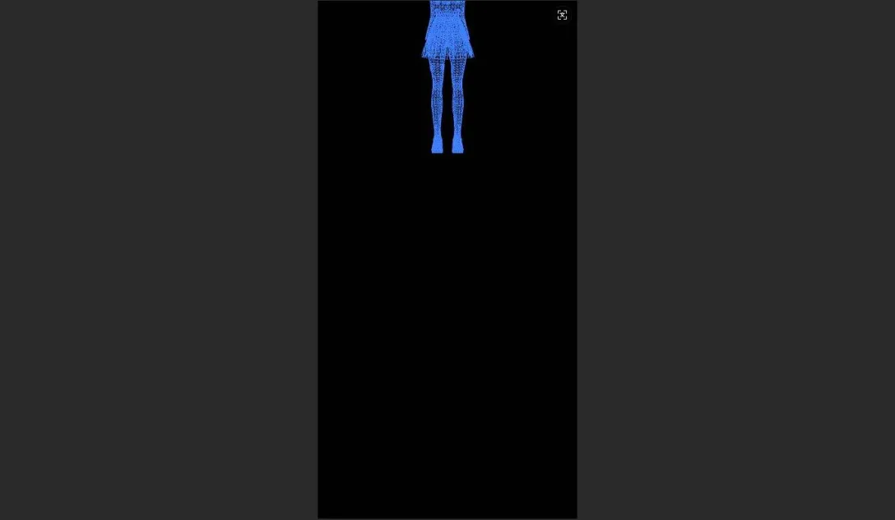
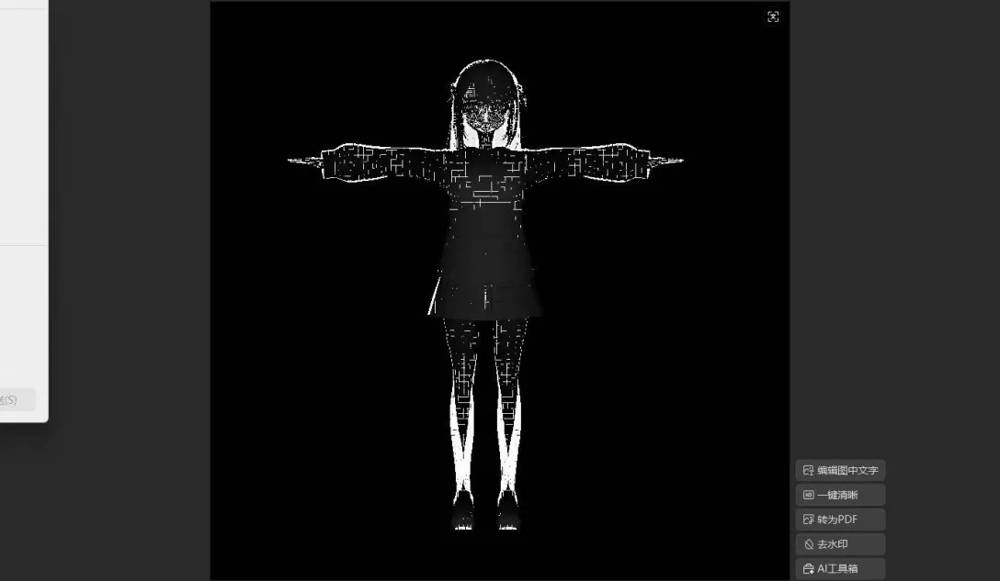
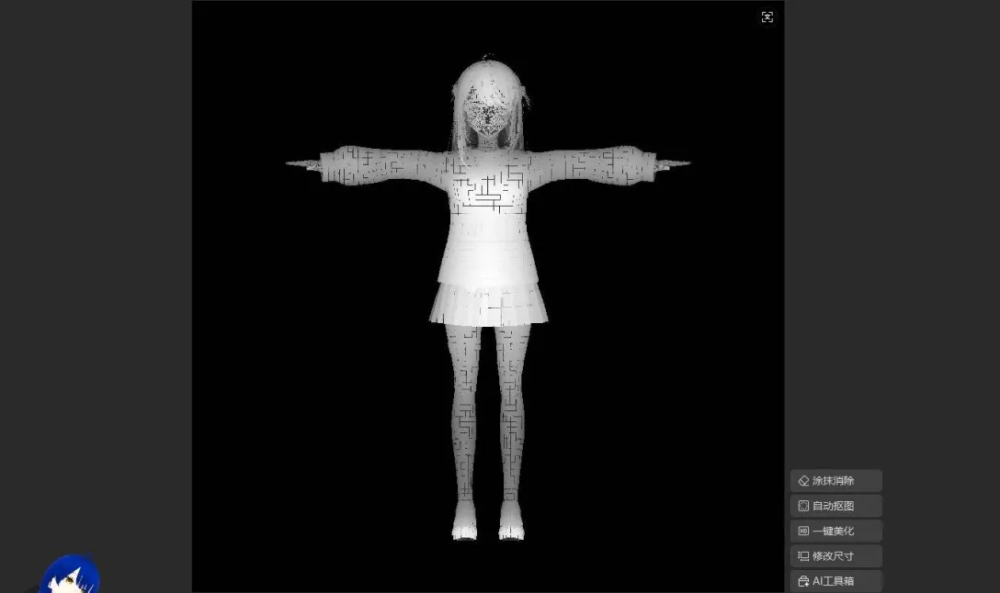
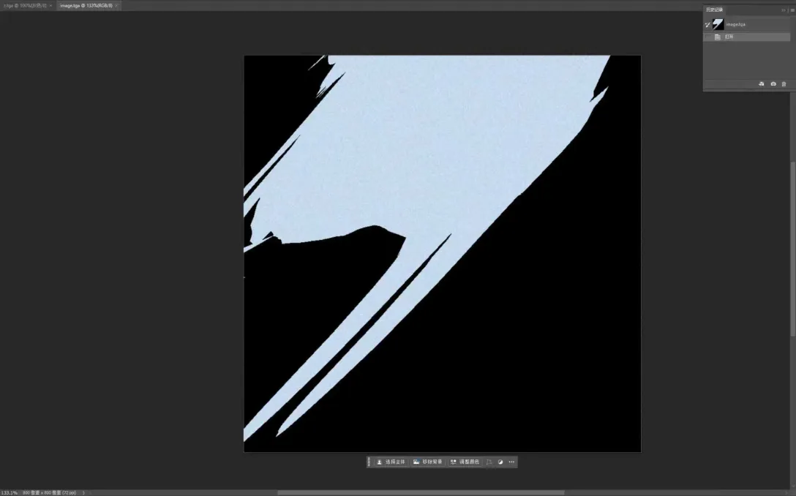
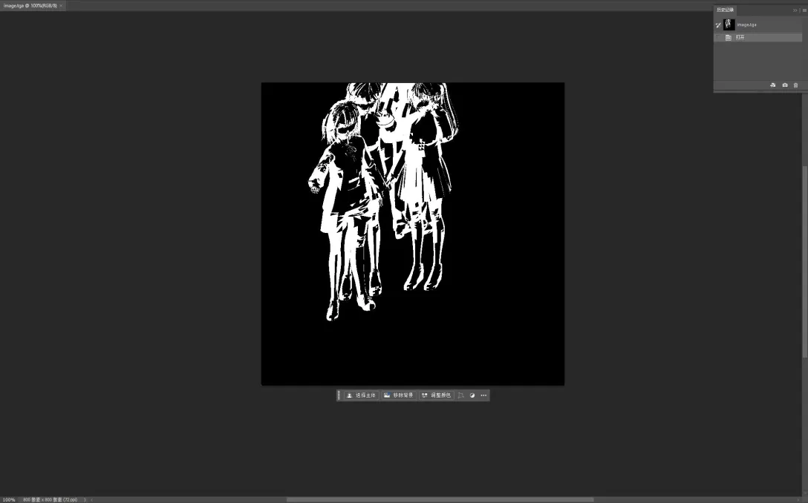
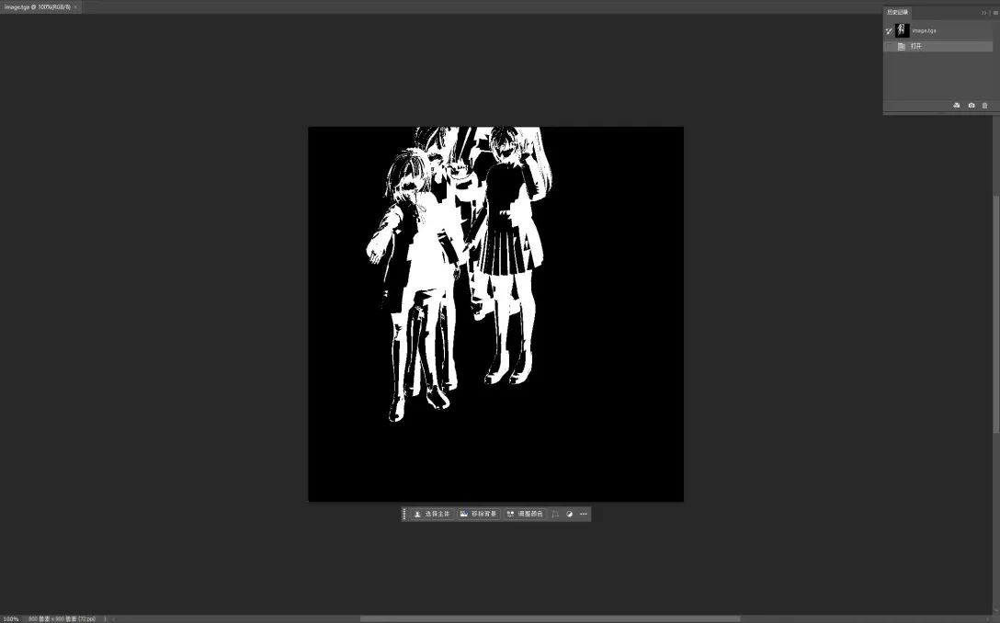
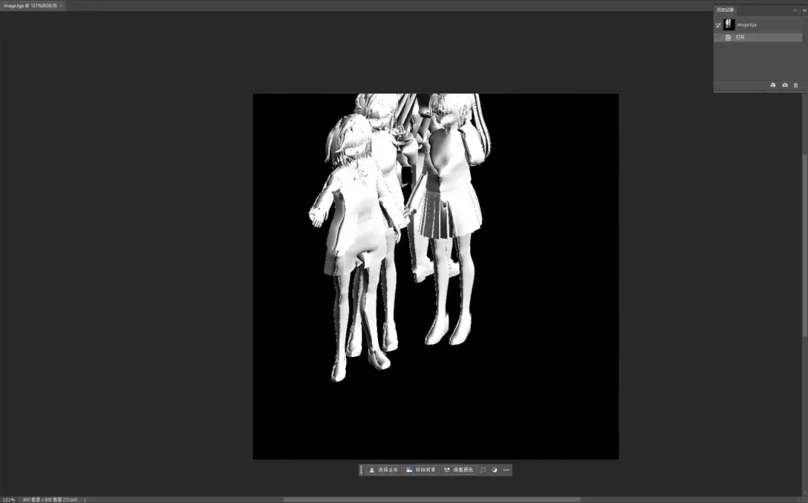
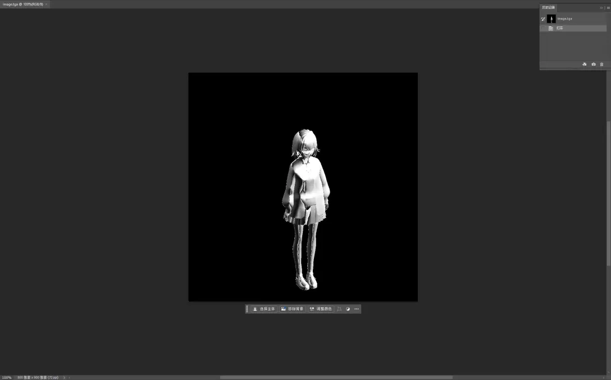
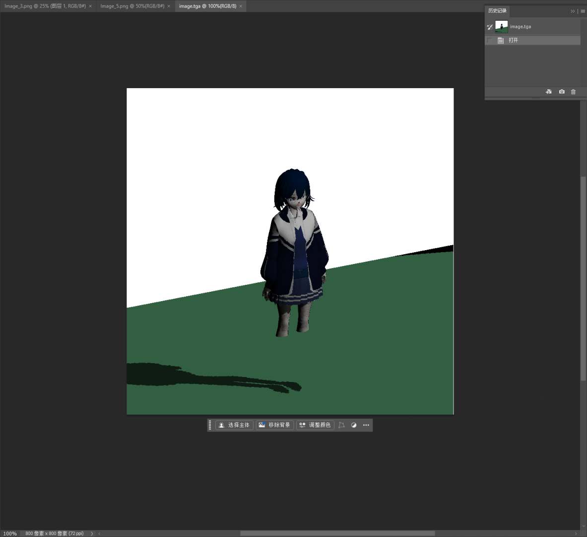

Here you could see some troubleshootings
more troubles such as obj/c++/etc...maybe I'll write in blog.

+ initial problem

+ wrong z(boundary/etc)

+ kindly forget...there are from z

+ camera wrong position
such as vector.w = 0/ points.w = 1
and some wrong from linear algebra and so on

+ phong
normalize properly

about L

+ some DCC cooperation problems

