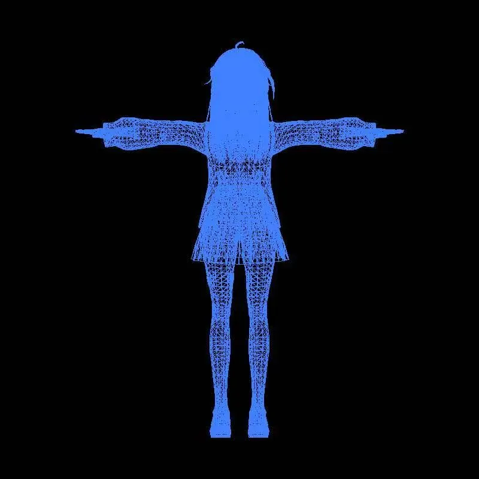
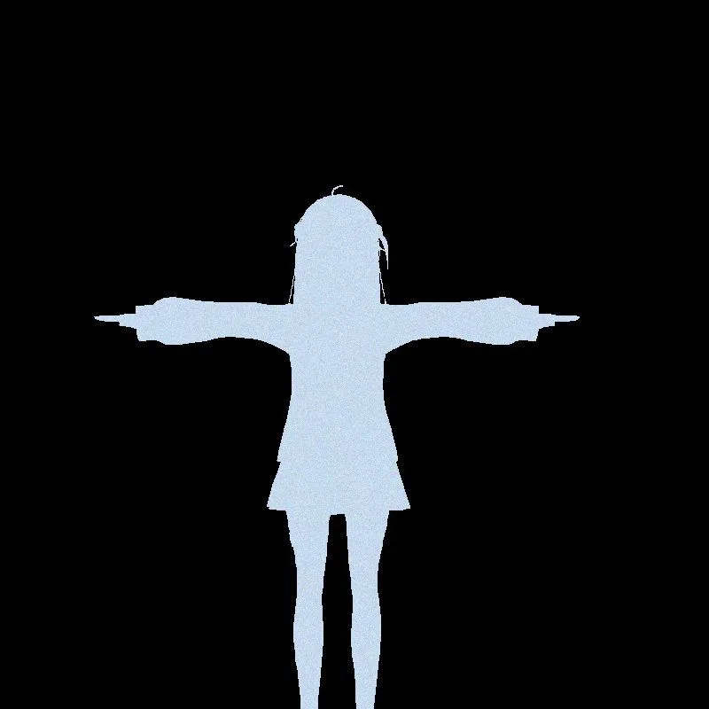
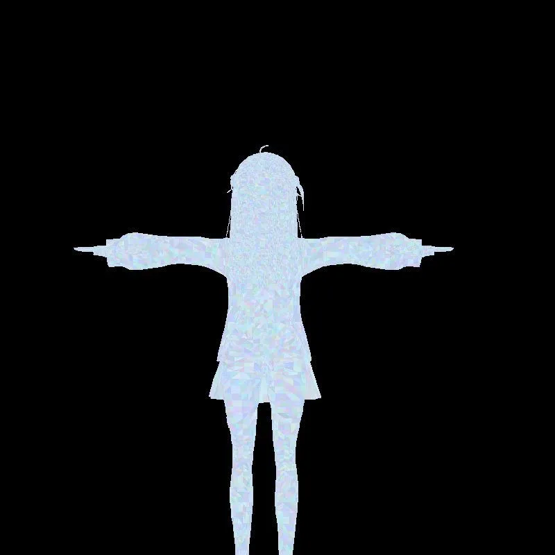
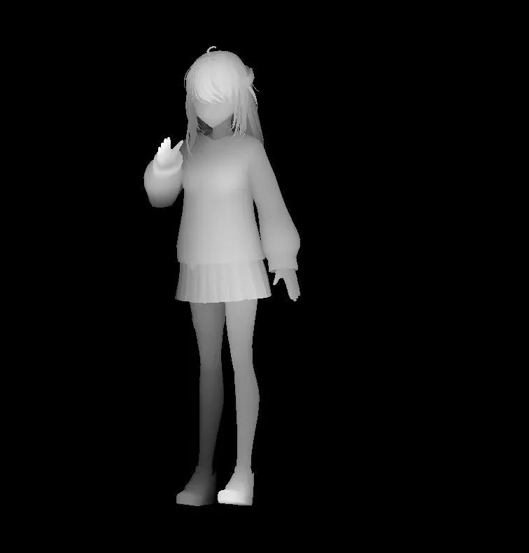
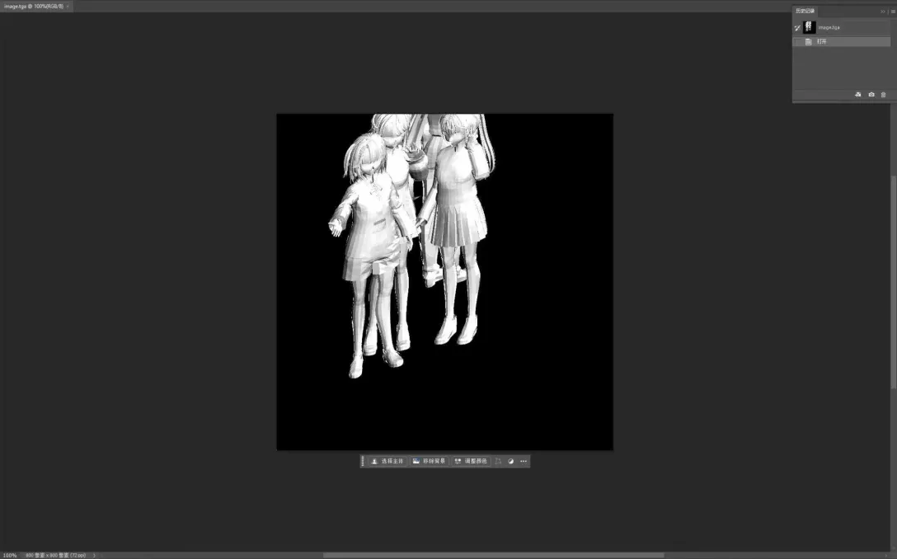
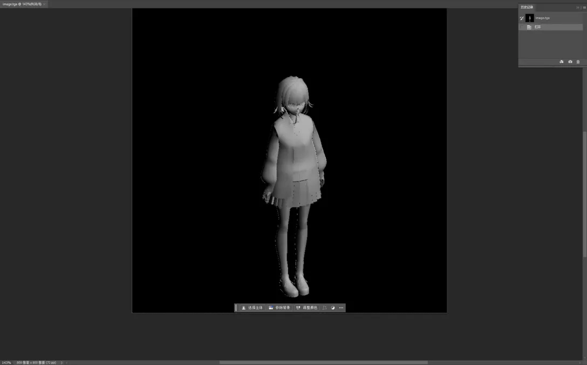
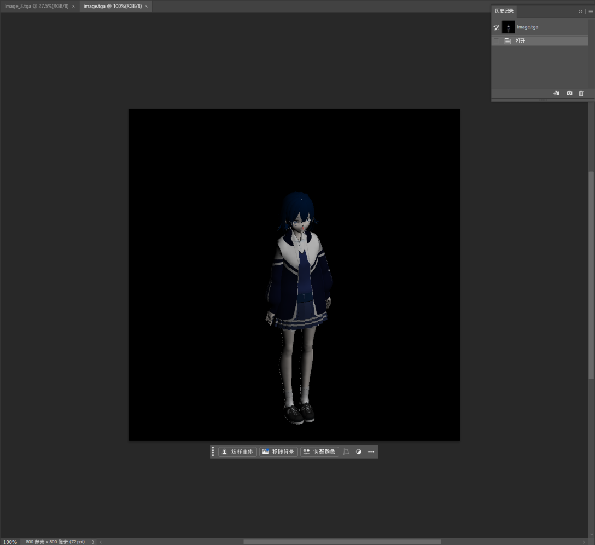

It is almost close to the end.So I decide to write something down
I create different switches to match different stage :)

I think the rendering photo just display all troubles I have met.
(Vroid Hub model(include textures/normalmap)
.....
After sorting, I decide to place my idol moments in [Catchhaa.md](Catchhaa.md).
Or see in my blog [tinyrenderer](https://tingfengkanyue.vercel.app/posts/tinyrenderer.html)

Here is some result in this Readme.md

(I think the obj file IO can add a ## before all...?)

## Bresenham's line drawing

+ note the axis and fov

## Triangle rasterization

+ note your obj whether is all triangles or have quads

## Barycentric coordinates

...

## hidden face removal

## Depth interpolation

## naive camera handling

## phong

## More data: texture/normal

+ smooth

+ textures

(vroid hub normal map is TBN map so...)

## Tangent space

## Shadow Mapping

